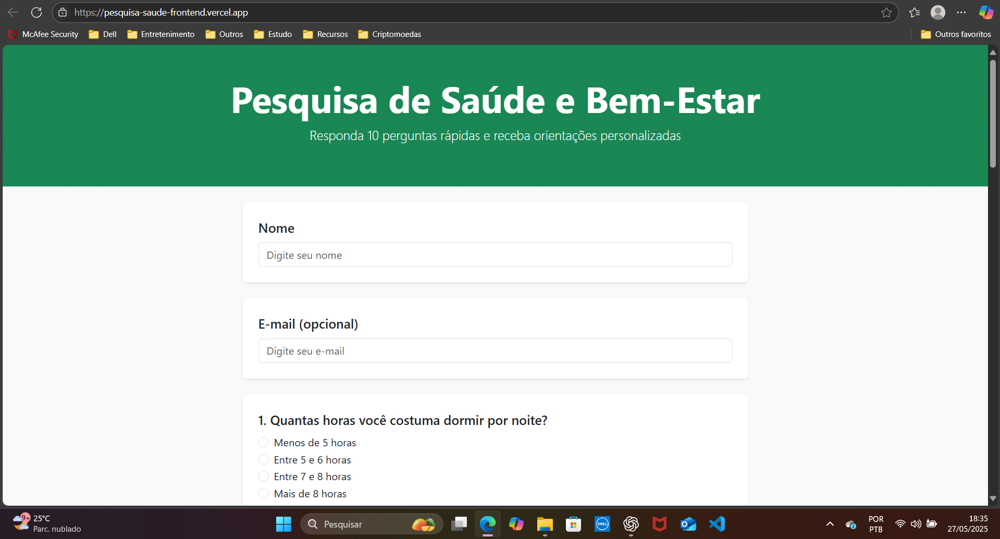

# Pesquisa de Saúde e Bem-Estar

Projeto desenvolvido para a **Atividade de Extensão Universitária** do curso de Análise e Desenvolvimento de Sistemas, visando a coleta de dados sobre saúde e bem-estar, com retorno de orientações personalizadas geradas por Inteligência Artificial.



## 📝 Descrição

Este sistema web permite a aplicação de um questionário interativo que coleta informações sobre hábitos de saúde e bem-estar. Após o preenchimento, o participante recebe uma análise personalizada com dicas geradas automaticamente através da API da OpenAI, com o objetivo de promover melhorias na qualidade de vida.

## 🚀 Tecnologias utilizadas

- HTML
- CSS
- Bootstrap
- JavaScript
- API OpenAI (via backend)

## 🌐 Acesso online

O sistema está publicado e pode ser acessado através do link abaixo:

🔗 [https://pesquisa-saude-frontend.vercel.app/](https://pesquisa-saude-frontend.vercel.app/)

## 💻 Como rodar localmente

1. Clone o repositório:

```bash
git clone https://github.com/LuizRaizen/pesquisa-saude-frontend.git
```

2. Acesse a pasta do projeto:

```bash
cd pesquisa-saude-frontend
```

3. Abra o arquivo `index.html` diretamente no seu navegador ou utilize uma extensão como **Live Server** no VSCode para melhor experiência.

⚠️ Importante: O frontend sozinho não consegue executar todas as suas funcionalidades. O backend é essencial para que o sistema funcione corretamente.

## 👤 Autor

Desenvolvido por **Luiz Ricardo Dererita de Araújo**.

## ⚠️ Licença

Este projeto é destinado exclusivamente para fins acadêmicos e de pesquisa universitária. **Não é autorizada a reprodução, distribuição ou comercialização parcial ou total** sem a devida autorização do autor.
